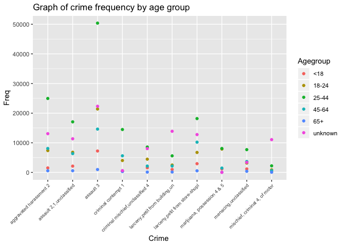
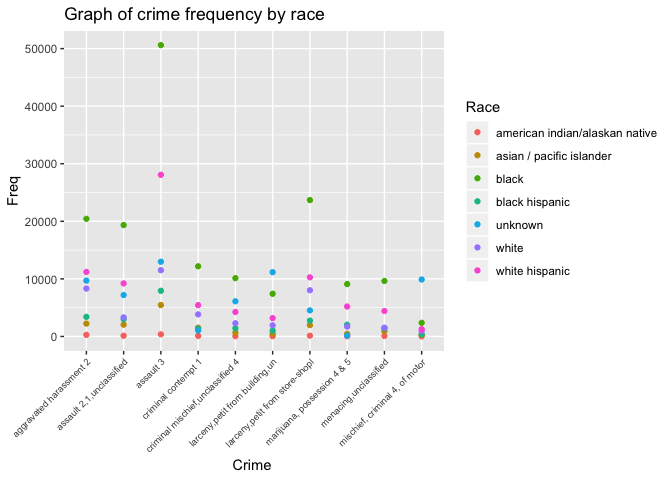
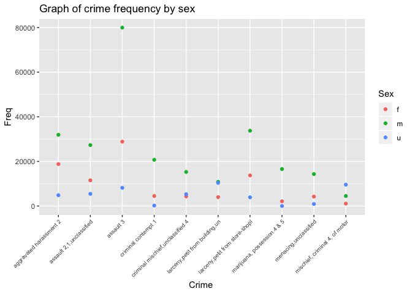

Final\_project
================
Yaa Klu
11/17/2018

``` r
crime_nyc = readRDS(file = "datasets/nyc_felony_misdemeanor.rds")
```

``` r
library(tidyverse)
```

    ## ── Attaching packages ────────────────────── tidyverse 1.2.1 ──

    ## ✔ ggplot2 3.0.0     ✔ purrr   0.2.5
    ## ✔ tibble  1.4.2     ✔ dplyr   0.7.6
    ## ✔ tidyr   0.8.1     ✔ stringr 1.3.1
    ## ✔ readr   1.1.1     ✔ forcats 0.3.0

    ## ── Conflicts ───────────────────────── tidyverse_conflicts() ──
    ## ✖ dplyr::filter() masks stats::filter()
    ## ✖ dplyr::lag()    masks stats::lag()

**Crime category by race/ethnicity, age, sex and other
sociodemographics** \*\* top ten offense, general chracteristics** **
top 5, general characteristics** **filter out unknown and analyze top 5
crimes for unknowns\*\*

Removing missing variables

``` r
com_crime_nyc = crime_nyc %>% 
  janitor::clean_names(dat = .) %>% 
  filter(!is.na(susp_sex)) %>%
  filter(!is.na(susp_age_group)) %>%
  filter(!is.na(vic_sex)) %>%
  filter(!is.na(vic_age_group)) %>%
  filter(!is.na(vic_race)) %>%
  filter(!is.na(susp_race))
```

Highest number of crimes (top 5)

``` r
com_crime_nyc %>%
  distinct(pd_desc) %>%
  count()
```

    ## # A tibble: 1 x 1
    ##       n
    ##   <int>
    ## 1   336

``` r
com_crime_nyc %>%
  filter(law_cat_cd == "felony") %>% 
  group_by(pd_desc, pd_cd) %>%
  summarise(number = n()) %>%
  ungroup() %>%
  top_n(10, number) %>%
  arrange(desc(number)) %>%
  knitr::kable() 
```

| pd\_desc                           | pd\_cd | number |
| :--------------------------------- | :----- | -----: |
| assault 2,1,unclassified           | 109    |  44270 |
| criminal contempt 1                | 198    |  25455 |
| robbery,personal electronic device | 386    |  10930 |
| robbery,open area unclassified     | 397    |   8998 |
| mischief,criminal, uncl 2nd        | 269    |   8675 |
| strangulation 1st                  | 105    |   8159 |
| forgery,etc.,unclassified-felo     | 729    |   8115 |
| weapons possession 3               | 793    |   6217 |
| burglary,residence,day             | 221    |   5381 |
| mischief, criminal 3 & 2, of m     | 267    |   5333 |

Suspect Age

``` r
com_crime_nyc %>%
  group_by(susp_age_group) %>%
  summarise(number = n()) %>%
  ungroup() %>%
  top_n(5, number) %>%
  arrange(desc(number)) %>%
  knitr::kable() 
```

| susp\_age\_group | number |
| :--------------- | -----: |
| 25-44            | 273331 |
| unknown          | 219984 |
| 18-24            | 120824 |
| 45-64            |  92508 |
| \<18             |  34589 |

Suspect Sex

``` r
com_crime_nyc %>%
  group_by(susp_sex) %>%
  summarise(number = n()) %>%
  ungroup() %>%
  top_n(3, number) %>%
  arrange(desc(number)) %>%
  knitr::kable() 
```

| susp\_sex | number |
| :-------- | -----: |
| m         | 485088 |
| u         | 133048 |
| f         | 128976 |

Victim’s sex

``` r
com_crime_nyc %>%
  group_by(vic_sex) %>%
  summarise(number = n()) %>%
  ungroup() %>%
  top_n(3, number) %>%
  arrange(desc(number)) %>%
  knitr::kable() 
```

| vic\_sex | number |
| :------- | -----: |
| f        | 305303 |
| m        | 238304 |
| e        | 105972 |

Victim’s age

``` r
com_crime_nyc %>%
  group_by(vic_age_group) %>%
  summarise(number = n()) %>%
  ungroup() %>%
  top_n(5, number) %>%
  arrange(desc(number)) %>%
  knitr::kable() 
```

| vic\_age\_group | number |
| :-------------- | -----: |
| 25-44           | 258662 |
| unknown         | 220115 |
| 45-64           | 120287 |
| 18-24           |  87259 |
| \<18            |  38136 |

Suspect’s age

``` r
com_crime_nyc %>%
  group_by(susp_race) %>%
  summarise(number = n()) %>%
  ungroup() %>%
  top_n(5, number) %>%
  arrange(desc(number)) %>%
  knitr::kable() 
```

| susp\_race     | number |
| :------------- | -----: |
| black          | 293349 |
| unknown        | 161358 |
| white hispanic | 143259 |
| white          |  75717 |
| black hispanic |  44328 |

Victim’s race

``` r
com_crime_nyc %>%
  group_by(vic_race) %>%
  summarise(number = n()) %>%
  ungroup() %>%
  top_n(5, number) %>%
  arrange(desc(number)) %>%
  knitr::kable()
```

| vic\_race                | number |
| :----------------------- | -----: |
| unknown                  | 233989 |
| black                    | 198086 |
| white hispanic           | 135812 |
| white                    | 100832 |
| asian / pacific islander |  45235 |

Suspect’s race

``` r
com_crime_nyc %>%
  group_by(pd_desc, susp_race) %>%
  summarise(number = n()) %>%
  ungroup() %>%
  top_n(5, number) %>%
  arrange(desc(number)) %>%
  knitr::kable()
```

| pd\_desc                       | susp\_race     | number |
| :----------------------------- | :------------- | -----: |
| assault 3                      | black          |  50605 |
| assault 3                      | white hispanic |  28076 |
| larceny,petit from store-shopl | black          |  23689 |
| aggravated harassment 2        | black          |  20440 |
| assault 2,1,unclassified       | black          |  19349 |

``` r
com_crime_nyc %>%
  group_by(susp_race, vic_race) %>%
  summarise(number = n()) %>%
  ungroup() %>%
  top_n(5, number) %>%
  arrange(desc(number)) %>%
  knitr::kable()
```

| susp\_race     | vic\_race      | number |
| :------------- | :------------- | -----: |
| black          | black          | 134775 |
| black          | unknown        |  97564 |
| white hispanic | white hispanic |  61768 |
| white hispanic | unknown        |  48060 |
| unknown        | black          |  40837 |

``` r
com_crime_nyc %>%
  group_by(susp_race, pd_desc) %>%
  summarise(number = n()) %>%
  ungroup() %>%
  top_n(5, number) %>%
  arrange(desc(number)) %>%
  knitr::kable()
```

| susp\_race     | pd\_desc                       | number |
| :------------- | :----------------------------- | -----: |
| black          | assault 3                      |  50605 |
| white hispanic | assault 3                      |  28076 |
| black          | larceny,petit from store-shopl |  23689 |
| black          | aggravated harassment 2        |  20440 |
| black          | assault 2,1,unclassified       |  19349 |

``` r
com_crime_nyc %>%
  group_by(pd_desc, susp_age_group) %>%
  summarise(number = n()) %>%
  ungroup() %>%
  top_n(5, number) %>%
  arrange(desc(number)) %>%
  knitr::kable() 
```

| pd\_desc                       | susp\_age\_group | number |
| :----------------------------- | :--------------- | -----: |
| assault 3                      | 25-44            |  50378 |
| aggravated harassment 2        | 25-44            |  24954 |
| assault 3                      | unknown          |  22327 |
| assault 3                      | 18-24            |  21397 |
| larceny,petit from store-shopl | 25-44            |  18165 |

**filter out unknown and analyze top 5 crimes for unknowns**

``` r
filter(com_crime_nyc, susp_age_group == 'unknown') %>%
  group_by(pd_cd) %>%
  summarise(n = n()) %>%
  filter() %>%
  knitr::kable() 
```

| pd\_cd |     n |
| :----- | ----: |
| 101    | 22327 |
| 103    |     4 |
| 104    |     2 |
| 105    |   311 |
| 106    |   119 |
| 107    |     3 |
| 108    |    20 |
| 109    | 11356 |
| 110    |    21 |
| 111    |     5 |
| 112    |    12 |
| 113    |  3392 |
| 114    |   415 |
| 115    |   532 |
| 117    |  1991 |
| 125    |    16 |
| 153    |    80 |
| 155    |    27 |
| 157    |   519 |
| 159    |   119 |
| 164    |    26 |
| 166    |     2 |
| 168    |   219 |
| 170    |    94 |
| 174    |    11 |
| 175    |  1643 |
| 177    |   173 |
| 178    |     1 |
| 179    |    25 |
| 181    |    20 |
| 183    |    13 |
| 185    |    18 |
| 186    |     6 |
| 187    |     5 |
| 191    |    27 |
| 193    |     7 |
| 195    |    17 |
| 197    |    50 |
| 198    |   620 |
| 199    |    15 |
| 203    |   304 |
| 204    |    53 |
| 205    |   604 |
| 209    |     4 |
| 211    |   760 |
| 213    |  2123 |
| 214    |   264 |
| 221    |  3193 |
| 223    |  2515 |
| 224    |   909 |
| 231    |   483 |
| 233    |   330 |
| 234    |    56 |
| 241    |    78 |
| 243    |   199 |
| 244    |    61 |
| 254    | 11066 |
| 256    |   383 |
| 258    |  4545 |
| 259    |  8033 |
| 261    |     6 |
| 263    |   254 |
| 264    |    95 |
| 265    |     1 |
| 266    |    20 |
| 267    |  2877 |
| 268    |    83 |
| 269    |  2016 |
| 271    |    10 |
| 273    |    13 |
| 277    |    57 |
| 285    |     1 |
| 293    |     2 |
| 301    |   442 |
| 303    |   563 |
| 305    |   405 |
| 307    |   180 |
| 313    |  1307 |
| 321    |  9140 |
| 323    |    10 |
| 327    |     1 |
| 329    |    18 |
| 331    |    14 |
| 333    | 12770 |
| 335    |   112 |
| 338    | 13882 |
| 339    |  6021 |
| 341    |    10 |
| 343    |  3347 |
| 344    |    67 |
| 347    |   469 |
| 349    |  2079 |
| 350    |    19 |
| 351    |    17 |
| 357    |  1782 |
| 360    |    70 |
| 361    |   197 |
| 363    |    58 |
| 365    |    16 |
| 366    |   188 |
| 367    |   178 |
| 371    |    13 |
| 373    |     5 |
| 375    |    44 |
| 377    |   294 |
| 379    |    65 |
| 380    |   142 |
| 381    |     1 |
| 382    |   532 |
| 383    |   331 |
| 384    |   883 |
| 385    |    41 |
| 386    |  4451 |
| 387    |   150 |
| 388    |  1020 |
| 389    |   314 |
| 390    |   587 |
| 391    |   151 |
| 392    |    56 |
| 393    |     7 |
| 394    |   190 |
| 395    |    13 |
| 396    |   481 |
| 397    |  4019 |
| 398    |   319 |
| 399    |   552 |
| 401    |   362 |
| 402    |  1568 |
| 403    |  1154 |
| 404    |  1505 |
| 405    |  1266 |
| 406    |  1041 |
| 407    |   321 |
| 408    |   604 |
| 409    |   662 |
| 410    |   968 |
| 411    |   923 |
| 412    |  1963 |
| 414    |   177 |
| 415    |  1158 |
| 416    |   658 |
| 417    |   641 |
| 418    |   733 |
| 419    |   637 |
| 420    |   629 |
| 421    |  3796 |
| 422    |  1069 |
| 423    |     2 |
| 424    |  1051 |
| 425    |  1102 |
| 426    |   151 |
| 428    |   145 |
| 430    |   574 |
| 431    |    33 |
| 432    |   254 |
| 433    |  1707 |
| 434    |    37 |
| 435    |    41 |
| 437    |   499 |
| 438    |  2595 |
| 439    |  1917 |
| 441    |  3503 |
| 442    |    14 |
| 443    |   750 |
| 445    |     2 |
| 450    |    52 |
| 451    |   740 |
| 455    |    30 |
| 457    |   695 |
| 461    |   232 |
| 462    |   549 |
| 464    |     4 |
| 466    |   108 |
| 475    |     2 |
| 476    |     1 |
| 478    |  1376 |
| 479    |     6 |
| 489    |   111 |
| 490    |    16 |
| 493    |     2 |
| 494    |     7 |
| 498    |     2 |
| 500    |     3 |
| 503    |     3 |
| 511    |     8 |
| 512    |     2 |
| 515    |     7 |
| 519    |     1 |
| 520    |     2 |
| 521    |    11 |
| 544    |     3 |
| 557    |     1 |
| 567    |    14 |
| 568    |     3 |
| 569    |    10 |
| 586    |     2 |
| 588    |     1 |
| 591    |     3 |
| 593    |     6 |
| 594    |     7 |
| 596    |    78 |
| 627    |     3 |
| 639    | 13079 |
| 640    |   140 |
| 643    |     2 |
| 644    |    40 |
| 645    |     4 |
| 647    |    25 |
| 649    |   146 |
| 652    |     1 |
| 659    |     2 |
| 661    |   529 |
| 662    |     4 |
| 663    |     9 |
| 664    |     1 |
| 665    |    88 |
| 674    |     1 |
| 681    |   307 |
| 683    |     2 |
| 687    |     1 |
| 688    |    12 |
| 694    |     1 |
| 696    |     8 |
| 697    |     3 |
| 698    |     1 |
| 701    |     1 |
| 703    |    18 |
| 705    |    46 |
| 707    |   109 |
| 708    |   116 |
| 711    |     4 |
| 718    |  1102 |
| 719    |     9 |
| 723    |     5 |
| 724    |     1 |
| 725    |     2 |
| 727    |     8 |
| 729    |   608 |
| 739    |  3128 |
| 742    |     1 |
| 748    |   215 |
| 749    |   405 |
| 750    |     8 |
| 759    |    73 |
| 760    |     3 |
| 770    |    21 |
| 772    |    41 |
| 779    |    14 |
| 781    |     5 |
| 782    |    56 |
| 792    |    42 |
| 793    |    42 |
| 799    |     9 |
| 802    |     2 |
| 809    |     2 |
| 812    |    30 |
| 815    |     2 |
| 817    |    36 |
| 818    |    34 |
| 844    |    21 |
| 847    |    64 |
| 848    |     1 |
| 878    |   804 |
| 887    |     3 |
| 905    |    10 |
| 916    |  4465 |
| 918    |     4 |
| 922    |     6 |
| NA     |     5 |

select top 10 crimes into a new dataset

``` r
top_ten_crime = com_crime_nyc %>%
  group_by(pd_desc, pd_cd) %>%
  summarise(number = n()) %>%
  ungroup() %>%
  top_n(10, number) 
 # arrange(desc(number)) %>%
```

``` r
mydataextract3 = list()
cc = top_ten_crime$pd_cd
for(j in 1:length(cc)){
  ind = cc[j]
#mydataextract =  com_crime_nyc[com_crime_nyc$pd_desc == cc, ]
mydataextract3[[j]] = com_crime_nyc[which(com_crime_nyc$pd_cd == ind, arr.ind = TRUE ), ]
mydataextract4 = do.call(rbind, mydataextract3)
} # has 397,023 obs
```

consider suspects demographics by the top ten crimes suspect age group

``` r
 table(mydataextract4$susp_age_group)
```

    ## 
    ##      -2     -54     -65     -67     -72    -948    -955    -960    -969 
    ##       1       1       1       1       1       1       1       1       1 
    ##    -974    -981     <18    1014    1016   18-24    2015    2016    2017 
    ##       1       1   19483       1       1   65187       2       3       5 
    ##   25-44   45-64     65+     923     927     931     935     940     945 
    ##  157213   54899    3673       1       1       1       1       1       1 
    ## unknown 
    ##   96539

``` r
sort(table(mydataextract4$susp_age_group))
```

    ## 
    ##      -2     -54     -65     -67     -72    -948    -955    -960    -969 
    ##       1       1       1       1       1       1       1       1       1 
    ##    -974    -981    1014    1016     923     927     931     935     940 
    ##       1       1       1       1       1       1       1       1       1 
    ##     945    2015    2016    2017     65+     <18   45-64   18-24 unknown 
    ##       1       2       3       5    3673   19483   54899   65187   96539 
    ##   25-44 
    ##  157213

``` r
#keep age groups < 18, 18-24, 25-44, 45-64, 65+, unknown
agegroup=c('<18', '45-64',   '18-24', 'unknown',   '25-44', '65+' )
mydata=mydataextract4[mydataextract4$susp_age_group %in% agegroup,]
suspect_agetopten=table(mydata$pd_desc,mydata$susp_age_group)
```

``` r
suspect_agetopten2=as.data.frame(suspect_agetopten)
mycolnames=c('Crime', 'Agegroup', 'Freq')
colnames(suspect_agetopten2)=mycolnames
suspect_agetopten2 %>%
group_by(Agegroup, Crime) %>%
  ggplot(aes(x = Crime, y = Freq, color = Agegroup)) +
   geom_point() +
#   geom_smooth(se=FALSE) +
labs(
  title = "Graph of crime frequency by age group",
  x = "Crime ",
  y = "Freq"
) +
  theme(axis.text.x = element_text(angle = 45, size = 7, hjust = 1))
```

<!-- -->

consider suspects demographics by the top ten crimes. suspect race

``` r
 table(mydataextract4$susp_race)
```

    ## 
    ## american indian/alaskan native       asian / pacific islander 
    ##                           1266                          16011 
    ##                          black                 black hispanic 
    ##                         164908                          24715 
    ##                        unknown                          white 
    ##                          64214                          43409 
    ##                 white hispanic 
    ##                          82500

``` r
sort(table(mydataextract4$susp_race))
```

    ## 
    ## american indian/alaskan native       asian / pacific islander 
    ##                           1266                          16011 
    ##                 black hispanic                          white 
    ##                          24715                          43409 
    ##                        unknown                 white hispanic 
    ##                          64214                          82500 
    ##                          black 
    ##                         164908

``` r
#keep age groups < 18, 18-24, 25-44, 45-64, 65+, unknown
suspect_racetopten=table(mydata$pd_desc,mydata$susp_race)
```

``` r
suspect_racetopten2=as.data.frame(suspect_racetopten)
mycolnames=c('Crime', 'Race', 'Freq')
colnames(suspect_racetopten2)=mycolnames
suspect_racetopten2 %>%
group_by(Race, Crime) %>%
  ggplot(aes(x = Crime, y = Freq, color = Race)) +
   geom_point() +
#   geom_smooth(se=FALSE) +
labs(
  title = "Graph of crime frequency by race",
  x = "Crime ",
  y = "Freq"
) +
  theme(axis.text.x = element_text(angle = 45, size = 7, hjust = 1))
```

<!-- -->

sex

``` r
table(mydataextract4$susp_sex)
```

    ## 
    ##      f      m      u 
    ##  93107 255185  48731

``` r
sort(table(mydataextract4$susp_sex))
```

    ## 
    ##      u      f      m 
    ##  48731  93107 255185

``` r
#keep age groups < 18, 18-24, 25-44, 45-64, 65+, unknown
suspect_sextopten=table(mydata$pd_desc,mydata$susp_sex)
suspect_sextopten
```

    ##                                   
    ##                                        f     m     u
    ##   aggravated harassment 2          18799 31918  4863
    ##   assault 2,1,unclassified         11512 27308  5444
    ##   assault 3                        28826 79940  8159
    ##   criminal contempt 1               4505 20737   210
    ##   criminal mischief,unclassified 4  4307 15285  5305
    ##   larceny,petit from building,un    3996 10872 10369
    ##   larceny,petit from store-shopl   13718 33747  3891
    ##   marijuana, possession 4 & 5       2111 16572     7
    ##   menacing,unclassified             4241 14308   906
    ##   mischief, criminal 4, of motor    1085  4479  9574

``` r
suspect_sextopten2=as.data.frame(suspect_sextopten)
mycolnames=c('Crime', 'Sex', 'Freq')
colnames(suspect_sextopten2)=mycolnames
suspect_sextopten2 %>%
group_by(Sex, Crime) %>%
  ggplot(aes(x = Crime, y = Freq, color = Sex)) +
   geom_point() +
#   geom_smooth(se=FALSE) +
labs(
  title = "Graph of crime frequency by sex",
  x = "Crime ",
  y = "Freq"
) +
  theme(axis.text.x = element_text(angle = 45, size = 7, hjust = 1))
```

<!-- -->
