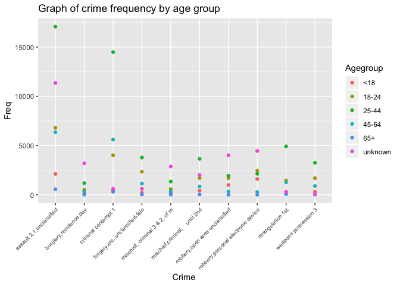
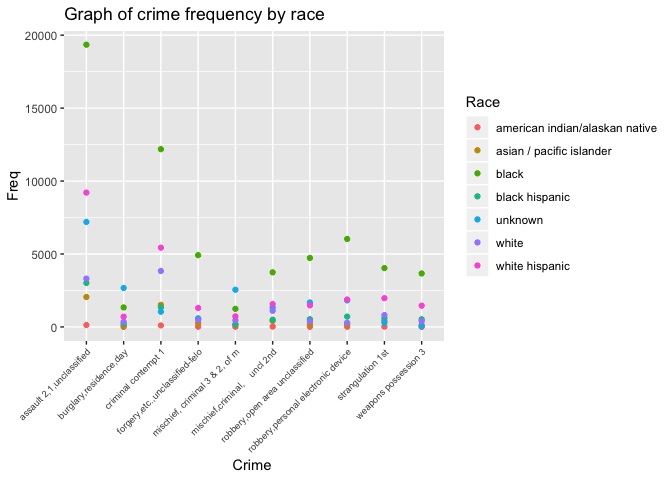
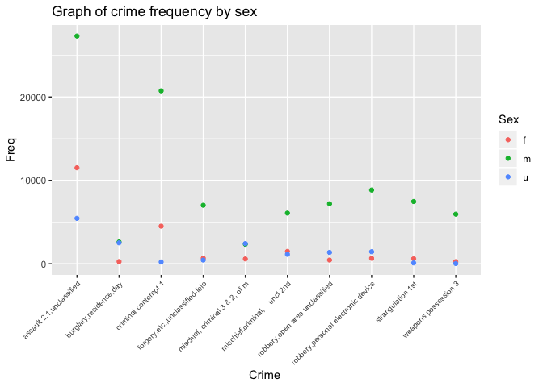

Final\_project
================
Yaa Klu
11/17/2018

``` r
library(tidyverse)
```

    ## ── Attaching packages ──────────────────────────────────────────────────────────────────────────────────────────────────────── tidyverse 1.2.1 ──

    ## ✔ ggplot2 3.1.0     ✔ purrr   0.2.5
    ## ✔ tibble  1.4.2     ✔ dplyr   0.7.8
    ## ✔ tidyr   0.8.1     ✔ stringr 1.3.1
    ## ✔ readr   1.1.1     ✔ forcats 0.3.0

    ## ── Conflicts ─────────────────────────────────────────────────────────────────────────────────────────────────────────── tidyverse_conflicts() ──
    ## ✖ dplyr::filter() masks stats::filter()
    ## ✖ dplyr::lag()    masks stats::lag()

``` r
crime_nyc = readRDS(file = "datasets/nyc_felony_crimes.rds")

crime_nyc %>% filter(law_cat_cd == "felony") %>% distinct(pd_cd, pd_desc) %>% 
  mutate(x = str_detect(pd_desc, "rape")) %>% 
  View
```

``` r
library(tidyverse)
```

**Crime category by race/ethnicity, age, sex and other sociodemographics** \*\* top ten offense, general chracteristics** ** top 5, general characteristics** **filter out unknown and analyze top 5 crimes for unknowns\*\*

Removing missing variables

``` r
com_crime_nyc = crime_nyc %>% 
  janitor::clean_names(dat = .) %>% 
  filter(!is.na(susp_sex)) %>%
  filter(!is.na(susp_age_group)) %>%
  filter(!is.na(vic_sex)) %>%
  filter(!is.na(vic_age_group)) %>%
  filter(!is.na(vic_race)) %>%
  filter(!is.na(susp_race))
```

Highest number of crimes (top 5)

``` r
com_crime_nyc %>%
  distinct(pd_desc) %>%
  count()
```

    ## # A tibble: 1 x 1
    ##       n
    ##   <int>
    ## 1   213

``` r
com_crime_nyc %>%
  filter(law_cat_cd == "felony") %>% 
  group_by(pd_desc, pd_cd) %>%
  summarise(number = n()) %>%
  ungroup() %>%
  top_n(10, number) %>%
  arrange(desc(number)) %>%
  knitr::kable() 
```

| pd\_desc                           | pd\_cd |  number|
|:-----------------------------------|:-------|-------:|
| assault 2,1,unclassified           | 109    |   44270|
| criminal contempt 1                | 198    |   25455|
| robbery,personal electronic device | 386    |   10930|
| robbery,open area unclassified     | 397    |    8998|
| mischief,criminal, uncl 2nd        | 269    |    8675|
| strangulation 1st                  | 105    |    8159|
| forgery,etc.,unclassified-felo     | 729    |    8115|
| weapons possession 3               | 793    |    6217|
| burglary,residence,day             | 221    |    5381|
| mischief, criminal 3 & 2, of m     | 267    |    5333|

Suspect Age

``` r
com_crime_nyc %>%
  group_by(susp_age_group) %>%
  summarise(number = n()) %>%
  ungroup() %>%
  top_n(5, number) %>%
  arrange(desc(number)) %>%
  knitr::kable() 
```

| susp\_age\_group |  number|
|:-----------------|-------:|
| unknown          |   90145|
| 25-44            |   88550|
| 18-24            |   41309|
| 45-64            |   27591|
| &lt;18           |   11531|

Suspect Sex

``` r
com_crime_nyc %>%
  group_by(susp_sex) %>%
  summarise(number = n()) %>%
  ungroup() %>%
  top_n(3, number) %>%
  arrange(desc(number)) %>%
  knitr::kable() 
```

| susp\_sex |  number|
|:----------|-------:|
| m         |  171270|
| u         |   56662|
| f         |   32782|

Victim's sex

``` r
com_crime_nyc %>%
  group_by(vic_sex) %>%
  summarise(number = n()) %>%
  ungroup() %>%
  top_n(3, number) %>%
  arrange(desc(number)) %>%
  knitr::kable() 
```

| vic\_sex |  number|
|:---------|-------:|
| f        |  104643|
| m        |   99208|
| e        |   32145|

Victim's age

``` r
com_crime_nyc %>%
  group_by(vic_age_group) %>%
  summarise(number = n()) %>%
  ungroup() %>%
  top_n(5, number) %>%
  arrange(desc(number)) %>%
  knitr::kable() 
```

| vic\_age\_group |  number|
|:----------------|-------:|
| 25-44           |   94015|
| unknown         |   62936|
| 45-64           |   44114|
| 18-24           |   32805|
| &lt;18          |   14706|

Suspect's age

``` r
com_crime_nyc %>%
  group_by(susp_race) %>%
  summarise(number = n()) %>%
  ungroup() %>%
  top_n(5, number) %>%
  arrange(desc(number)) %>%
  knitr::kable() 
```

| susp\_race     |  number|
|:---------------|-------:|
| black          |  106066|
| unknown        |   66282|
| white hispanic |   43845|
| white          |   21080|
| black hispanic |   14385|

Victim's race

``` r
com_crime_nyc %>%
  group_by(vic_race) %>%
  summarise(number = n()) %>%
  ungroup() %>%
  top_n(5, number) %>%
  arrange(desc(number)) %>%
  knitr::kable()
```

| vic\_race                |  number|
|:-------------------------|-------:|
| black                    |   72052|
| unknown                  |   68123|
| white hispanic           |   49005|
| white                    |   40332|
| asian / pacific islander |   19303|

Suspect's race

``` r
com_crime_nyc %>%
  group_by(pd_desc, susp_race) %>%
  summarise(number = n()) %>%
  ungroup() %>%
  top_n(5, number) %>%
  arrange(desc(number)) %>%
  knitr::kable()
```

| pd\_desc                           | susp\_race     |  number|
|:-----------------------------------|:---------------|-------:|
| assault 2,1,unclassified           | black          |   19349|
| criminal contempt 1                | black          |   12186|
| assault 2,1,unclassified           | white hispanic |    9213|
| assault 2,1,unclassified           | unknown        |    7201|
| robbery,personal electronic device | black          |    6029|

``` r
com_crime_nyc %>%
  group_by(susp_race, vic_race) %>%
  summarise(number = n()) %>%
  ungroup() %>%
  top_n(5, number) %>%
  arrange(desc(number)) %>%
  knitr::kable()
```

| susp\_race     | vic\_race      |  number|
|:---------------|:---------------|-------:|
| black          | black          |   48186|
| black          | unknown        |   30387|
| white hispanic | white hispanic |   19906|
| unknown        | black          |   16444|
| unknown        | white          |   14946|

``` r
com_crime_nyc %>%
  group_by(susp_race, pd_desc) %>%
  summarise(number = n()) %>%
  ungroup() %>%
  top_n(5, number) %>%
  arrange(desc(number)) %>%
  knitr::kable()
```

| susp\_race     | pd\_desc                           |  number|
|:---------------|:-----------------------------------|-------:|
| black          | assault 2,1,unclassified           |   19349|
| black          | criminal contempt 1                |   12186|
| white hispanic | assault 2,1,unclassified           |    9213|
| unknown        | assault 2,1,unclassified           |    7201|
| black          | robbery,personal electronic device |    6029|

``` r
com_crime_nyc %>%
  group_by(pd_desc, susp_age_group) %>%
  summarise(number = n()) %>%
  ungroup() %>%
  top_n(5, number) %>%
  arrange(desc(number)) %>%
  knitr::kable() 
```

| pd\_desc                 | susp\_age\_group |  number|
|:-------------------------|:-----------------|-------:|
| assault 2,1,unclassified | 25-44            |   17072|
| criminal contempt 1      | 25-44            |   14486|
| assault 2,1,unclassified | unknown          |   11356|
| assault 2,1,unclassified | 18-24            |    6801|
| assault 2,1,unclassified | 45-64            |    6350|

**filter out unknown and analyze top 5 crimes for unknowns**

``` r
filter(com_crime_nyc, susp_age_group == 'unknown') %>%
  group_by(pd_cd) %>%
  summarise(n = n()) %>%
  filter() %>%
  knitr::kable() 
```

| pd\_cd |      n|
|:-------|------:|
| 103    |      4|
| 104    |      2|
| 105    |    311|
| 106    |    119|
| 107    |      3|
| 108    |     20|
| 109    |  11356|
| 110    |     21|
| 112    |     12|
| 117    |   1991|
| 125    |     16|
| 153    |     80|
| 155    |     27|
| 157    |    519|
| 159    |    119|
| 164    |     26|
| 166    |      2|
| 168    |    219|
| 177    |    173|
| 178    |      1|
| 179    |     25|
| 183    |     13|
| 185    |     18|
| 186    |      6|
| 187    |      5|
| 193    |      7|
| 197    |     50|
| 198    |    620|
| 199    |     15|
| 204    |     53|
| 211    |    760|
| 213    |   2123|
| 214    |    264|
| 221    |   3193|
| 223    |   2515|
| 224    |    909|
| 231    |    483|
| 233    |    330|
| 234    |     56|
| 241    |     78|
| 243    |    199|
| 244    |     61|
| 261    |      6|
| 263    |    254|
| 264    |     95|
| 265    |      1|
| 266    |     20|
| 267    |   2877|
| 268    |     83|
| 269    |   2016|
| 273    |     13|
| 285    |      1|
| 293    |      2|
| 360    |     70|
| 361    |    197|
| 363    |     58|
| 365    |     16|
| 366    |    188|
| 367    |    178|
| 371    |     13|
| 373    |      5|
| 375    |     44|
| 377    |    294|
| 379    |     65|
| 380    |    142|
| 381    |      1|
| 382    |    532|
| 383    |    331|
| 384    |    883|
| 385    |     41|
| 386    |   4451|
| 387    |    150|
| 388    |   1020|
| 389    |    314|
| 390    |    587|
| 391    |    151|
| 392    |     56|
| 393    |      7|
| 394    |    190|
| 395    |     13|
| 396    |    481|
| 397    |   4019|
| 398    |    319|
| 399    |    552|
| 401    |    362|
| 402    |   1568|
| 403    |   1154|
| 404    |   1505|
| 405    |   1266|
| 406    |   1041|
| 407    |    321|
| 408    |    604|
| 409    |    662|
| 410    |    968|
| 411    |    923|
| 412    |   1963|
| 414    |    177|
| 415    |   1158|
| 416    |    658|
| 417    |    641|
| 418    |    733|
| 419    |    637|
| 420    |    629|
| 421    |   3796|
| 422    |   1069|
| 423    |      2|
| 424    |   1051|
| 425    |   1102|
| 426    |    151|
| 428    |    145|
| 430    |    574|
| 431    |     33|
| 432    |    254|
| 433    |   1707|
| 434    |     37|
| 435    |     41|
| 437    |    499|
| 438    |   2595|
| 439    |   1917|
| 441    |   3503|
| 442    |     14|
| 443    |    750|
| 445    |      2|
| 450    |     52|
| 451    |    740|
| 455    |     30|
| 457    |    695|
| 461    |    232|
| 489    |    111|
| 493    |      2|
| 494    |      7|
| 498    |      2|
| 500    |      3|
| 503    |      3|
| 512    |      2|
| 515    |      7|
| 519    |      1|
| 520    |      2|
| 521    |     11|
| 557    |      1|
| 568    |      3|
| 586    |      2|
| 588    |      1|
| 594    |      7|
| 596    |     78|
| 640    |    140|
| 644    |     40|
| 663    |      9|
| 664    |      1|
| 665    |     88|
| 674    |      1|
| 694    |      1|
| 696    |      8|
| 697    |      3|
| 698    |      1|
| 708    |    116|
| 711    |      4|
| 723    |      5|
| 724    |      1|
| 725    |      2|
| 727    |      8|
| 729    |    608|
| 739    |   3128|
| 760    |      3|
| 772    |     41|
| 779    |     14|
| 781    |      5|
| 792    |     42|
| 793    |     42|
| 844    |     21|
| 847    |     64|
| NA     |      5|

select top 10 crimes into a new dataset

``` r
top_ten_crime = com_crime_nyc %>%
  group_by(pd_desc, pd_cd) %>%
  summarise(number = n()) %>%
  ungroup() %>%
  top_n(10, number) 
 # arrange(desc(number)) %>%
```

``` r
mydataextract3 = list()
cc = top_ten_crime$pd_cd
for(j in 1:length(cc)){
  ind = cc[j]
#mydataextract =  com_crime_nyc[com_crime_nyc$pd_desc == cc, ]
mydataextract3[[j]] = com_crime_nyc[which(com_crime_nyc$pd_cd == ind, arr.ind = TRUE ), ]
mydataextract4 = do.call(rbind, mydataextract3)
} # has 397,023 obs
```

consider suspects demographics by the top ten crimes suspect age group

``` r
 table(mydataextract4$susp_age_group)
```

    ## 
    ##      -2     -67     <18    1014    1016   18-24    2016    2017   25-44 
    ##       1       1    6491       1       1   23252       2       2   53784 
    ##   45-64     65+     926     940     945 unknown 
    ##   17419    1083       1       1       1   29493

``` r
sort(table(mydataextract4$susp_age_group))
```

    ## 
    ##      -2     -67    1014    1016     926     940     945    2016    2017 
    ##       1       1       1       1       1       1       1       2       2 
    ##     65+     <18   45-64   18-24 unknown   25-44 
    ##    1083    6491   17419   23252   29493   53784

``` r
#keep age groups < 18, 18-24, 25-44, 45-64, 65+, unknown
agegroup=c('<18', '45-64',   '18-24', 'unknown',   '25-44', '65+' )
mydata=mydataextract4[mydataextract4$susp_age_group %in% agegroup,]
suspect_agetopten=table(mydata$pd_desc,mydata$susp_age_group)
```

``` r
suspect_agetopten2=as.data.frame(suspect_agetopten)
mycolnames=c('Crime', 'Agegroup', 'Freq')
colnames(suspect_agetopten2)=mycolnames
suspect_agetopten2 %>%
group_by(Agegroup, Crime) %>%
  ggplot(aes(x = Crime, y = Freq, color = Agegroup)) +
   geom_point() +
#   geom_smooth(se=FALSE) +
labs(
  title = "Graph of crime frequency by age group",
  x = "Crime ",
  y = "Freq"
) +
  theme(axis.text.x = element_text(angle = 45, size = 7, hjust = 1))
```



consider suspects demographics by the top ten crimes. suspect race

``` r
 table(mydataextract4$susp_race)
```

    ## 
    ## american indian/alaskan native       asian / pacific islander 
    ##                            339                           5436 
    ##                          black                 black hispanic 
    ##                          61228                           8165 
    ##                        unknown                          white 
    ##                          19207                          11434 
    ##                 white hispanic 
    ##                          25724

``` r
sort(table(mydataextract4$susp_race))
```

    ## 
    ## american indian/alaskan native       asian / pacific islander 
    ##                            339                           5436 
    ##                 black hispanic                          white 
    ##                           8165                          11434 
    ##                        unknown                 white hispanic 
    ##                          19207                          25724 
    ##                          black 
    ##                          61228

``` r
#keep age groups < 18, 18-24, 25-44, 45-64, 65+, unknown
suspect_racetopten=table(mydata$pd_desc,mydata$susp_race)
```

``` r
suspect_racetopten2=as.data.frame(suspect_racetopten)
mycolnames=c('Crime', 'Race', 'Freq')
colnames(suspect_racetopten2)=mycolnames
suspect_racetopten2 %>%
group_by(Race, Crime) %>%
  ggplot(aes(x = Crime, y = Freq, color = Race)) +
   geom_point() +
#   geom_smooth(se=FALSE) +
labs(
  title = "Graph of crime frequency by race",
  x = "Crime ",
  y = "Freq"
) +
  theme(axis.text.x = element_text(angle = 45, size = 7, hjust = 1))
```



sex

``` r
table(mydataextract4$susp_sex)
```

    ## 
    ##     f     m     u 
    ## 20936 95522 15075

``` r
sort(table(mydataextract4$susp_sex))
```

    ## 
    ##     u     f     m 
    ## 15075 20936 95522

``` r
#keep age groups < 18, 18-24, 25-44, 45-64, 65+, unknown
suspect_sextopten=table(mydata$pd_desc,mydata$susp_sex)
suspect_sextopten
```

    ##                                     
    ##                                          f     m     u
    ##   assault 2,1,unclassified           11512 27308  5444
    ##   burglary,residence,day               259  2615  2507
    ##   criminal contempt 1                 4505 20737   210
    ##   forgery,etc.,unclassified-felo       661  7013   441
    ##   mischief, criminal 3 & 2, of m       576  2337  2420
    ##   mischief,criminal,    uncl 2nd      1477  6070  1128
    ##   robbery,open area unclassified       444  7191  1362
    ##   robbery,personal electronic device   651  8840  1439
    ##   strangulation 1st                    601  7461    96
    ##   weapons possession 3                 249  5942    26

``` r
suspect_sextopten2=as.data.frame(suspect_sextopten)
mycolnames=c('Crime', 'Sex', 'Freq')
colnames(suspect_sextopten2)=mycolnames
suspect_sextopten2 %>%
group_by(Sex, Crime) %>%
  ggplot(aes(x = Crime, y = Freq, color = Sex)) +
   geom_point() +
#   geom_smooth(se=FALSE) +
labs(
  title = "Graph of crime frequency by sex",
  x = "Crime ",
  y = "Freq"
) +
  theme(axis.text.x = element_text(angle = 45, size = 7, hjust = 1))
```


