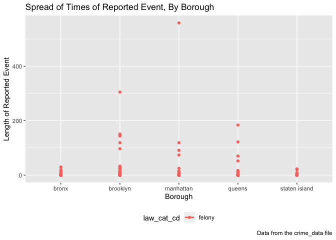

date\_and\_borough
================
Jacky Choi
November 18, 2018

This is one of the exploratory analyses for our P8105 - Data Science group project. In this exploratory analysis, we attempt to look at whether the length of time of the reported event differs by borough.

First, I load the tidyverse and patchwork package.

    ## ── Attaching packages ──────────────────────────────────────────────────────────────────────────────────────────────────────── tidyverse 1.2.1 ──

    ## ✔ ggplot2 3.1.0     ✔ purrr   0.2.5
    ## ✔ tibble  1.4.2     ✔ dplyr   0.7.8
    ## ✔ tidyr   0.8.1     ✔ stringr 1.3.1
    ## ✔ readr   1.1.1     ✔ forcats 0.3.0

    ## ── Conflicts ─────────────────────────────────────────────────────────────────────────────────────────────────────────── tidyverse_conflicts() ──
    ## ✖ dplyr::filter() masks stats::filter()
    ## ✖ dplyr::lag()    masks stats::lag()

    ## Skipping install of 'patchwork' from a github remote, the SHA1 (fd7958ba) has not changed since last install.
    ##   Use `force = TRUE` to force installation

Next, I read in the CSV file and tidy it up. I limit the data by randomly sampling 1,000 observations from the data frame.

``` r
crime_df = readRDS(file = "datasets/nyc_felony_crimes.rds")

crime_data = crime_df %>% 
  janitor::clean_names() %>%
  sample_n(1000) %>% 
  mutate(time_diff = (difftime(cmplnt_to_dt, cmplnt_fr_dt))) %>% 
  mutate(time_diff2 = (as.numeric(cmplnt_to_dt - cmplnt_fr_dt, units = "days", na.rm = TRUE))) %>% 
  select(cmplnt_fr_dt, cmplnt_to_dt, law_cat_cd, time_diff, time_diff2, boro_nm)

head(crime_data)
```

    ##   cmplnt_fr_dt cmplnt_to_dt law_cat_cd time_diff time_diff2  boro_nm
    ## 1   2016-11-02   2016-11-02     felony    0 secs          0 brooklyn
    ## 2   2015-03-12   2015-03-12     felony    0 secs          0   queens
    ## 3   2016-11-11   2016-11-11     felony    0 secs          0 brooklyn
    ## 4   2016-05-06   2016-05-06     felony    0 secs          0   queens
    ## 5   2015-03-07   2015-03-07     felony    0 secs          0   queens
    ## 6   2017-07-10   2017-07-10     felony    0 secs          0 brooklyn

I can look at the data in a table to examine general trends and get a feel of my data.

``` r
crime_table = 
  crime_data %>% 
  knitr::kable(digits = 2)

head(crime_table, 12)
```

    ##  [1] "cmplnt_fr_dt   cmplnt_to_dt   law_cat_cd   time_diff        time_diff2  boro_nm       "
    ##  [2] "-------------  -------------  -----------  --------------  -----------  --------------"
    ##  [3] "2016-11-02     2016-11-02     felony       0 secs                 0.00  brooklyn      "
    ##  [4] "2015-03-12     2015-03-12     felony       0 secs                 0.00  queens        "
    ##  [5] "2016-11-11     2016-11-11     felony       0 secs                 0.00  brooklyn      "
    ##  [6] "2016-05-06     2016-05-06     felony       0 secs                 0.00  queens        "
    ##  [7] "2015-03-07     2015-03-07     felony       0 secs                 0.00  queens        "
    ##  [8] "2017-07-10     2017-07-10     felony       0 secs                 0.00  brooklyn      "
    ##  [9] "2014-11-10     2014-11-10     felony       0 secs                 0.00  brooklyn      "
    ## [10] "2015-10-05     2015-10-19     felony       1209600 secs          14.00  brooklyn      "
    ## [11] "2015-04-10     2015-04-10     felony       0 secs                 0.00  queens        "
    ## [12] "2017-11-25     NA             felony       NA                       NA  queens        "

I can also look at whether the length of time for the reported event/crime differs by borough visually.

``` r
crime_data2 <- crime_data[complete.cases(crime_data),]

crime_graph2 = 
  crime_data2 %>% 
  group_by(boro_nm, law_cat_cd) %>% 
  ggplot(aes(x = boro_nm, y = time_diff2, color = law_cat_cd)) + 
  geom_point() +
    labs(
    title = "Spread of Times of Reported Event, By Borough",
    x = "Borough",
    y = "Length of Reported Event",
    caption = "Data from the crime_data file"
    ) +
  geom_smooth(se = FALSE) +
  theme(legend.position = "bottom")

crime_graph2
```

    ## `geom_smooth()` using method = 'loess' and formula 'y ~ x'

 From the graph above, we can see a couple of things. First, there are, numerically speaking, fewer reported events in Staten Island. Secondly, the spread of the reported events seems to be slightly larger in the Bronx than in other boroughs. Lastly, although the spread among Brooklyn, Manhattan, and Queens is approximately the same, Queens has more outliers.
