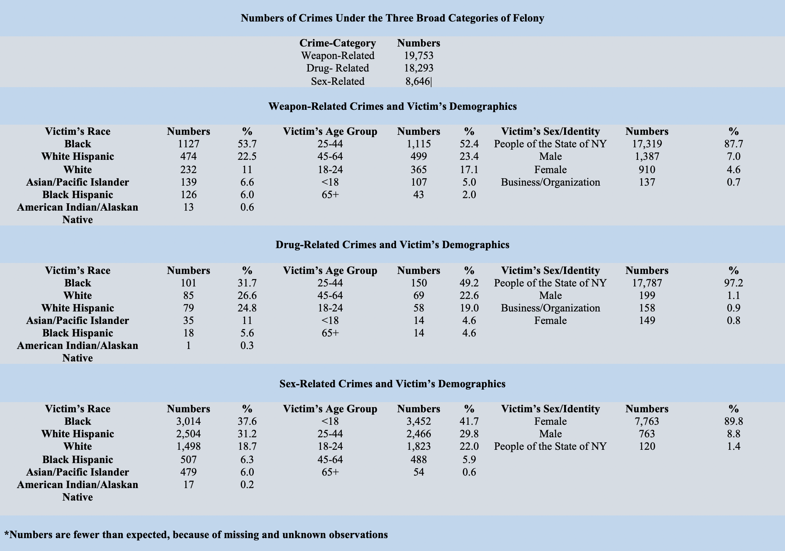

<br>

<style>
.list-group-item.active, .list-group-item.active:focus, .list-group-item.active:hover {
    background-color: #337ab7;
}

.navbar-default .navbar-collapse, .navbar-default .navbar-form {
background-color: #337ab7;
}

.navbar-default {
background-color: #337ab7;
}

.navbar-default .navbar-nav>li>a {
color: white;
font-weight: bold;
}

.navbar-default .navbar-brand {
color: white;
font-weight: bold;
}

</style>

## Brief Description
This is a report summarizing everything we completed for this project, including our approach, our data cleaning and manipulation steps, our initial questions driving our analyses, our exploratory and formal statistical analyses, and our various graphs and visualizations.

<br>

## Our Drive For The Project
According to [MentalHealth.gov](https://www.mentalhealth.gov/basics), mental health includes our emotional, psychological, and social well-being and it largely affects quality of life for an individual. The factors that contribute to mental health issues include biological factors, family history, and life experiences such as trauma and abuse. Trauma and/or abuse, in particular, can occur or result from being a victim of a crime, especially from felonies, where the level of violence, danger, severity, and risk of crime tends to be higher compared to other crime categories. Although New York City does not have one of the highest crime rates in the country, it is still one of the most crowded and populated cities, setting itself up as a unique location for crimes. As a result, the ripple effects of crimes can have an impact on NYC residents physically, but also have a more lasting and devastating effect on them mentally that tangibly affects others not directly affected by or involved in the crime.

In addition to the unique impacts of crime in New York City, the location provides a wealth of open and transparent data for anyone to study and analyze. Gathering such data and computing statistics on crime in NYC may provide critical insights regarding steps to be taken for other similar high-density and highly populated areas, which can be helpful for law enforcement and government officials to deter crime. For these particular reasons, we focused on examining the various factors, patterns, and variables associated with crime in New York City.

We decided to study sex-related, drug-related, and weapons-related felonies in particular for a couple of reasons. First, we felt that there was a significant overlap among these three types of felonies - drug-related crimes, for example, are often committed concurrently with weapons-related crimes. Secondly, we felt that it was important to know the statistics on felonies, especially as experienced by victims, since such information may provide important indicators for mental health advocacy. Third, our raw data contained over 6 million observations and we wanted to reasonably limit our scope a bit. Fourth, as mentioned above, felonies are generally ranked higher compared to misdemeanors and violations, in terms of violence, risk, severity, and danger, providing us with potentially more important insights than the other categories. These reasons led us to explore data on the three main types of felonies (sex-related, weapon-related and drug-related) that occurred in New York City from 2014 to 2017.

<br>

## Initial Questions
After settling on the NYC Historic Complaint data, we came up with many questions we thought would be interesting to examine:

*	How can we study the distribution of crime categories (felonies, misdemeanors, or violations) across boroughs?
*	When are crimes being committed? How can we visualize this information by months of the year, day of the week, or even hours of the day?
*	How do the crime rates change over time?
*	Were crimes successfully attempted? If so, which types of crimes and where?
*	What are the top 5 crimes and where are they being committed?
*	Do any age groups disproportionately affected by a particular crime?

However, over the course of the project, we decided to settle on questions that were at least tangentially relevant to each other, especially when it came to the exploratory analyses. We also wanted to focus our questions and analyses on several important patterns, namely, how crimes changed over the years, how they changed across boroughs, and how they changed by type of felony—because we felt that there was a lot we could do analytically and visually with these patterns alone—but also utilize different variables to show meaningful results. Furthermore, as mentioned above, we restricted our questions related to the specific crime category (included felonies, excluded misdemeanors and violations) and the type of felony (included sex-related, drug-related, and weapons-related felonies only) within the chosen crime category that we chose to examine. Lastly, we decided to focus on the years 2014 to 2017 because these were the most recent years for which data were available. Our main questions evolved to the following:

*	What were the sociodemographic variables (e.g., race, age, gender of the victim/suspect) associated with the various felonies committed in the different boroughs of New York City?
*	What was the average time of reported felonies and did this differ across boroughs or by type of felony?
*	What were the overall crime rates and trends/patterns of these felonies?
*	What was the geographic and time distribution of these felonies?
*	Does the occurrence of each type of felony differ by borough and if so, how?

<br>

## Data Source 
We used the dataset collected by the New York City Police Department (NYPD); specifically, we utilized the NYPD Historic Complaint dataset, which provides longitudinal information on complaints filed to the NYPD, the type of crimes committed by a suspect, suspect demographics, victim demographics, location of crime, date and time of crime, and other variables. The link to the raw dataset is [here](https://data.cityofnewyork.us/Public-Safety/NYPD-Complaint-Data-Historic/qgea-i56i). 

In terms of cleaning the dataset, we first utilized several R packages, including the `RSocrata` (needed to access web API queries), `ggmap` (needed to geocode), `tidyverse` (standard package), and `lubridate` (data manipulation) packages. The code for installing and loading the packages are below, as well as the code to access the raw dataset directly from the web.

<br>

```{r setup, include=FALSE}
knitr::opts_chunk$set(echo = FALSE)
knitr::opts_chunk$set(warning = FALSE)
knitr::opts_chunk$set(message = FALSE)
```

### Accessing the Data
```{r acquiringdata_libraries, eval = FALSE}
library(tidyverse)
library(RSocrata)
library(lubridate)

if(!requireNamespace("devtools")) install.packages("devtools")
devtools::install_github("dkahle/ggmap", ref = "tidyup")
ggmap(get_googlemap())
register_google(key = "insert your google api key here")
```


```{r acquiringdata_api, eval = FALSE}
## Install the required package with:
## install.packages("RSocrata) if not already installed

nyc_crime = read.socrata(
  "https://data.cityofnewyork.us/resource/9s4h-37hy.json",
  app_token = "xxxx",
  email     = "xxxx",
  password  = "xxxx" )
```

The raw, acquired dataset has 6,036,805 observations and 35 variables. Broadly speaking, the variables contain information on the exact date, time and location of crime, description of crime, demographic information of the victim and suspect, and police department information. 

<br>

### Subsetting Data 
We were interested in 2014 to 2017 data pertaining to sex-related, weapons-related and drug-related felony. Therefore, we extracted this information from the data. 

Below is a list of the penal codes in the dataset that we used to select the felonies of interest. Following that is the code we used to subset our data.

##### Sex – Related Felony Crimes <br>

`178` Facilitating A Sex Offense With A Controlled Substance <br>
`694` Incest <br>
`697` Use Of A Child In Sexual Performance <br>
`176` Sex Crimes <br>
`180` Course Of Sexual Conduct Against Child <br>
`153` Rape 3 <br>
`157` Rape 1 <br>
`177` Sexual Abuse <br>
`168` Sodomy 1 <br>
`159` Rape 1 Attempt <br>
`166` Sodomy 2 <br>
`164` Sodomy 3 <br>
`179` Aggrevated Sexual Abuse <br>
`155` Rape 2 <br>
`586` Sextrafficking <br>
`696` Promoting Sexual Performance – Child <br>

##### Drug - Related Felony Crimes <br>

`500` Controlled Substance, Possession <br>
`501` Controlled Substance, Possession <br>
`502` Controlled Substance, Possession <br>
`503` Controlled Substance, Intent To <br>
`505` Controlled Substance, Possession <br>
`507` Controlled Substance, Possession <br>
`510` Controlled Substance, Intent T <br>
`512` Controlled Substance, Sale 1 <br>
`514` Controlled Substance, Sale 2 <br>
`515` Controlled Substance, Sale 3 <br>
`519` Sale School Grounds 4 <br>
`520` Controlled Substance, Sale 4 <br>
`521` Controlled Substance, Sale 5 <br>
`523` Sale School Grounds <br>
`524` Controlled Substance, Possession<br>
`529` Sales Of Prescription <br>
`530` Drug, Injection Of <br>
`531` Drug Paraphernalia, Possessesion <br>
`532` Controlled Substance,Possession <br>
`568` Marijuana, Possession 1, 2 & 3 <br>
`570` Marijuana, Sale 1, 2 & 3 <br>

##### Weapon - Related Felony Crimes <br> 

`781` Criminal Disposal Firearm 1 <br>
`792` Weapons Possession 1 & 2 <br>
`793` Weapons Possession 3  <br>
`796` Weapons,Prohibited Use <br>

```{r acquiringdata_manip, eval = FALSE}
#This code was used to retrieve and assess the observations with missing date of crime 
#occurrence

crime_missing_cp = nyc_crime %>% 
  summarize_all(funs(sum(is.na(.))))

#Cleaning and subsetting the data

nyc_felony_crimes = nyc_crime %>% 
  janitor::clean_names() %>% 
  mutate(year = year(cmplnt_fr_dt))%>%
  mutate_if(is.character, tolower) %>% 
  filter(year %in% 2014:2017) %>% 
  filter(law_cat_cd == "felony") %>% 
  select(- station_name, - transit_district, - hadevelopt, - patrol_boro, - housing_psa, 
         - juris_desc)

saveRDS(nyc_felony_crimes, file = "./datasets/nyc_felony_crimes.rds")

#Selecting crimes of interest
sex_drug_weapons = nyc_felony_crimes %>% 
  filter(pd_cd %in% c(178, 694, 697, 176, 180, 153, 157, 177, 168, 159, 166, 164, 179, 155,
                      586, 696, # Sex related felony crimes
                      
                      ## Drug related felony crimes
                      500, 501, 502, 503, 505, 507, 510, 512, 514, 515, 519, 520, 521, 523,
                      524, 529, 530, 531, 532, 568, 570,
                      
                      ### Weapon related felony crimes
                      781, 792, 793, 796)) %>% 
  
  mutate(longitude = as.numeric(longitude),
         latitude = as.numeric(latitude)) %>% 
  
  select(cmplnt_num, boro_nm, cmplnt_fr_dt, cmplnt_to_dt, cmplnt_fr_tm, latitude, longitude,
         ky_cd, ofns_desc, pd_cd, pd_desc, vic_race, vic_sex, vic_age_group, year, 
         prem_typ_desc) %>% 
  
  mutate(
             boro_nm = if_else(boro_nm == "staten island", "staten_island", boro_nm),
             
         crime_group = if_else(pd_cd %in% c(178, 694, 697, 176, 180, 153, 157, 177, 168, 159,
                                            166, 164, 179, 155, 586, 696), "Sex-Related", 
                               
                       if_else(pd_cd %in% c(500, 501, 502, 503, 505, 507, 510, 512, 514, 515,
                                            519, 520, 521, 523, 524, 529, 530, 531, 532, 568, 
                                            570), "Drug-Related", 
                               
                       if_else(pd_cd %in% c(781, 792, 793, 796), "Weapon-Related", pd_cd)))
         )

saveRDS(sex_drug_weapons, file = "./datasets/sex_drug_weapons.rds")
```

The resulting dataset called `sex_drug_weapons` dataset has 46,692 observations and 16 variables. 

<br>

### Reverse Geocoding
The dataset comes without zip code or neighborhood information; there are only coordinates of the exact location where the crime happened. This makes aggregation beyond clustering of the geographic points impossible. Therefore, we used Google Maps’ API to reverse geocode and get the exact address of the crime occurrence. We limited ourselves to 2017 data only to reduce the burden when using Google's API. We then subsequently took out the zip codes for mapping. The full code on how we reverse geocoded the longitude and latitude information is below.
```{r acquiringdata_drug, eval = FALSE}
#### Felony - Drug Offenses
#### Sampling only year 2017 and selecting all felony drug rape reports

### Drug offenses in 2017
drug_2017 = sex_drug_weapons %>% 
            filter(crime_group == "Drug-Related" & 
            year == 2017)

### Sampling to reduce the dataset to avoid getting rejected by Google API
drug_2017_1 = drug_2017 %>% 
              sample_n(2290)

drug_2017_zip_1 = drug_2017_1 %>% 
  mutate(zip = map2(.x = longitude, .y = latitude, ~ revgeocode(c(lon = .x, lat = .y))))

saveRDS(drug_2017_zip_1, file = "datasets/drug_2017_zip_1.rds")

#### Getting the data not sample. Second half of the data
drug_2017_2 = anti_join(drug_2017, drug_2017_zip_1, by = "cmplnt_num")

#### Iterating to get the data
drug_2017_zip_2 = drug_2017_2 %>% 
  mutate(zip = map2(.x = longitude, .y = latitude, ~ revgeocode(c(lon = .x, lat = .y))))

saveRDS(drug_2017_zip_2, file = "datasets/drug_2017_zip_2.rds")

### Joining to have the complete dataset

complete_drug_zip_2017 = bind_rows(drug_2017_zip_1, drug_2017_zip_2) 

saveRDS(complete_drug_zip_2017, file = "datasets/complete_drug_zip_2017.rds")
```

```{r acquiringdata_sex, eval = FALSE}
#### Felony - Sex Offenses

#The same process will be used for the sex-related crimes. There are 1993 observations; 
#therefore, there's no need to split the data before reverse geocoding.

sex_2017 = sex_drug_weapons %>% 
           filter(crime_group == "Sex-Related" & 
           year == 2017)

complete_sex_zip_2017 = sex_2017 %>% 
  mutate(zip = map2(.x = longitude, .y = latitude, ~ revgeocode(c(lon = .x, lat = .y))))

saveRDS(complete_sex_zip_2017, file = "datasets/complete_sex_zip_2017.rds")
```

```{r acquiringdata_weapons, eval = FALSE}
#### Felony - Weapon Offenses
weapon_2017 = sex_drug_weapons %>% 
              filter(crime_group == "Weapon-Related" & 
              year == 2017)

complete_weapon_zip_2017 = weapon_2017 %>% 
  mutate(zip = map2(.x = longitude, .y = latitude, ~ revgeocode(c(lon = .x, lat = .y))))

saveRDS(complete_weapon_zip_2017, file = "datasets/complete_weapon_zip_2017.rds")
```

```{r acquiringdata_zip, eval = FALSE}
#### 2017 Dataset With Zip Codes
#Dataset with the 3 crimes together with their zipcodes
all_sex_drug_weapon_zip_2017 = bind_rows(complete_drug_zip_2017, complete_sex_zip_2017, 
                                         complete_weapon_zip_2017) 

saveRDS(all_sex_drug_weapon_zip_2017, file = "datasets/all_sex_drug_weapon_zip_2017.rds")
```

<br>

### Usage
After cleaning, subsetting and reverse geocoding, we saved the resulting dataset in `rds` format. You can download the resulting datasets [from this Google Drive](https://drive.google.com/open?id=1QZB8nKClFl9qZV20Sa15Lf7ZbIlxBcis). The code on how to read the datasets can also be found in our repository file called [`acquiringdata.Rmd`](https://github.com/aminyakubu/nyc-crime/blob/master/acquiringdata.Rmd)

```{r acquiringdata_usage, eval = FALSE}

### nyc_felony_crimes dataset
readRDS(file = "./datasets/nyc_felony_crimes.rds")

### sex_drug_weapons dataset
readRDS(file = "./datasets/sex_drug_weapons.rds")

### Drug offenses for 2017 with zipcodes
readRDS(complete_drug_zip_2017, file = "datasets/complete_drug_zip_2017.rds")

### Sex offenses for 2017 with zipcodes
readRDS(complete_sex_zip_2017, file = "datasets/complete_sex_zip_2017.rds")

### Weapon offenses for 2017 with zipcodes
readRDS(complete_weapon_zip_2017, file = "datasets/complete_weapon_zip_2017.rds")

### Weapons, sex, drug for 2017 with zipcodes
readRDS(file = "datasets/all_sex_drug_weapon_zip_2017.rds")
```

<br>

### Data Dictionary
The list below provides all 17 variables in the datasets with their brief descriptions:

<p> `cmplnt_num`: randomly generated persistent ID for each complaint <br> <p>

`boro_nm`: the name of the borough in which the incident occurred <br> <p>
`cmplnt_fr_dt`: exact start date of occurrence for the reported incident <br> <p>
`cmplnt_to_dt`: exact end date of occurrent for the reported incident <br> <p>
`cmplnt_fr_tm`: exact time of occurrence for the reported incident <br> <p>
`latitude`: midblock latitude coordinate for Global Coordinate System, WGS 1984, decimal degrees (EPSG 4326) <br> <p>
`longitude`: midblock longitude coordinate for Global Coordinate System, WGS 1984, decimal degrees (EPSG 4326) <br> <p>
`ky_cd`: three-digit offense classification code <br> <p>
`ofns_desc`: description of offense corresponding with key code <br> <p>
`pd_cd`: three-digit internal classification code (more granular than Key Code) <br> <p>
`pd_desc`: description of internal classification corresponding with PD code <br>
`vic_race`: victim’s race description <br> <p>
`vic_sex`: victim’s sex description (D=Business/Organization, E=PSNY/People of the State of New York, F=Female, M=Male) <br> <p>
`year`: year the incident occurred <br> <p>
`prem_typ_desc`: specific description of premises; grocery store, residence, street, etc. <br> <p>
`crime_group`: sex-related felony offenses, drug-related felony offenses, weapon-related felony offenses <br> <p>
`zip`: reverse geocoded address of the incident <br> <p>

<br>

## Exploratory Analysis
Our exploratory analyses sought to examine various patterns and trends among the 3 types of felonies across boroughs and across the years. We also wanted to fully maximize the richness of the dataset and made sure to conduct various analyses we felt would be helpful and insightful. We loaded the necessary R packages with the code below.
```{r exp_libraries}
library(tidyverse)
library(rvest)
library(plotly)
library(tidyverse)
library(htmltools)
library(htmlwidgets)
library(leaflet)
library(leaflet.extras)
library(chron)
library(lubridate)
library(rgdal)
library(geojsonio)
library(sp)
library(maps)
library(tmap)
```

<br>

### Victim Demographics
For our first exploratory analysis, we analyzed demographic information for victims of sex-related, weapon-related and drug-related felonies. 

```{r, import_data}
felony_crime = readRDS(file = "./datasets/sex_drug_weapons.rds")
```

```{r}
felony_graph =
  felony_crime %>%
  filter(!is.na(vic_age_group), vic_age_group != "unknown")
```

<center>
<br> <br>
</center>

<br>
Note that in the table above, "People of the State of NY" indicates that the information was not provided by the city, presumably to protect the victims' identity and privacy. Also of note is that young women are disproportionately affected by sex-relate felonies.

The code used to build the table above is shown below.
```{r exp_yaa_data}
felony_crime = readRDS(file = "./datasets/sex_drug_weapons.rds")
overall_felony = readRDS(file = "./datasets/nyc_felony_crimes.rds")
complete_data = inner_join(overall_felony, felony_crime, by = "cmplnt_num") %>%
  janitor::clean_names(dat = .) 
```

```{r num_crimes_all_felonies}
complete_data %>%
  group_by(crime_group) %>%
  summarise(number = n()) %>%
  arrange(desc(number)) %>%
  knitr::kable()
```

```{r weapons_race}
complete_data %>%
  filter(crime_group == "Weapon-Related") %>%
  filter(!is.na(vic_race_y), vic_race_y != "unknown") %>% 
  group_by(vic_race_y) %>%
  summarise(number = n()) %>% arrange(desc(number)) %>% 
  knitr::kable() 
```

```{r weapons_age}
complete_data %>%
  filter(crime_group == "Weapon-Related") %>%
  filter(!is.na(vic_age_group_y), vic_age_group_y != "unknown") %>% 
  group_by(vic_age_group_y) %>%
  summarise(number = n()) %>% arrange(desc(number)) %>% 
  knitr::kable() 
```

```{r weapons_sex}
complete_data %>%
  filter(crime_group == "Weapon-Related") %>%
  filter(!is.na(vic_sex_y), vic_sex_y != "unknown") %>% 
  group_by(vic_sex_y) %>%
  summarise(number = n()) %>% arrange(desc(number)) %>% 
  knitr::kable() 
```

```{r drug_race}
complete_data %>%
  filter(crime_group == "Drug-Related") %>%
  filter(!is.na(vic_race_y), vic_race_y != "unknown") %>% 
  group_by(vic_race_y) %>%
  summarise(number = n()) %>% arrange(desc(number)) %>% 
  knitr::kable()
```

```{r drug_age}
complete_data %>%
  filter(crime_group == "Drug-Related") %>%
  filter(!is.na(vic_age_group_y), vic_age_group_y != "unknown") %>% 
  group_by(vic_age_group_y) %>%
  summarise(number = n()) %>% arrange(desc(number)) %>% 
  knitr::kable() 
```

```{r drug_sex}
complete_data %>%
  filter(crime_group == "Drug-Related") %>%
  filter(!is.na(vic_sex_y), vic_sex_y != "unknown") %>% 
  group_by(vic_sex_y) %>%
  summarise(number = n()) %>% arrange(desc(number)) %>% 
  knitr::kable() 
```

```{r sex_race}
complete_data %>%
  filter(crime_group == "Sex-Related") %>%
  filter(!is.na(vic_race_y), vic_race_y != "unknown") %>% 
  group_by(vic_race_y) %>%
  summarise(number = n()) %>% arrange(desc(number)) %>% 
  knitr::kable() 
```

```{r sex_age}
complete_data %>%
  filter(crime_group == "Sex-Related") %>%
  filter(!is.na(vic_age_group_y), vic_age_group_y != "unknown") %>% 
  group_by(vic_age_group_y) %>%
  summarise(number = n()) %>% arrange(desc(number)) %>% 
  knitr::kable()
```

```{r sex_sex}
complete_data %>%
  filter(crime_group == "Sex-Related") %>%
  filter(!is.na(vic_sex_y), vic_sex_y != "unknown") %>% 
  group_by(vic_sex_y) %>%
  summarise(number = n()) %>% arrange(desc(number)) %>% 
  knitr::kable() 
```

f = female, m = male, e = people of new york (non-binary gender), d = business/organization
<br>
<br>

### Length of Reported Incident by Borough and Felony

<br>

For our second exploratory analysis, We examined whether the length of time between when the crime started and ended differed by borough and felony type. Examining the length of time between when the crime started and ended can serve as a proxy indicator of the severity of the crime. Longer times may mean the crime is more severe, harder to resolve, more violent, and may require more resources to deal with. Furthermore, differences in the length of reported felonies may have implications for law enforcement officials, policymakers, and urban residents.

```{r}
time_data = felony_crime %>%
  mutate(crime_group = forcats::fct_relevel(crime_group, "Drug-Related"),
         boro_nm = forcats::fct_relevel(boro_nm, "manhattan")) %>% 
  janitor::clean_names() %>% 
  mutate(time_diff2 = (as.numeric(cmplnt_to_dt - cmplnt_fr_dt, units = "days", na.rm = TRUE))) %>% 
  select(time_diff2, boro_nm, crime_group) %>% 
  mutate(time_diff2 = if_else(is.na(time_diff2), 0, time_diff2)) 
# if value is missing it means the crime doesn't have an end date. It happened at a point in time. 
```

<br>

##### Average Length of Incident by Borough and Crime Group 

```{r exp_tidy_crime_data2}
time_data %>% rename(`Crime group` = crime_group) %>% 
group_by(`Crime group`) %>%
  summarise(Count = n(), 
            `Average time in days` = mean(time_diff2),
             `Standard deviation` = sd(time_diff2)) %>% knitr::kable()
```

```{r exp_mean_time_tables}

time_data %>% filter(!is.na(boro_nm)) %>% 
  rename(Borough = boro_nm) %>% 
  group_by(Borough) %>%
  summarise(Count = n(), `Average time in days` = mean(time_diff2), 
            `Standard deviation` = sd(time_diff2)) %>% 
  knitr::kable(digits = 2) 
```

There seems to be a marked difference in the average length of incidents across boroughs and felony type. Notably, we see that, on average, sex-related felonies seem to have a longer average incident length than drug- and weapon-related felonies. In terms of boroughs, Staten Island slightly ranks higher than the rest of the boroughs. 

We wanted to investigate further. First, we visually investigated the distribution of the length of each incident across all boroughs and all three felony types.
```{r exp_density_plot}

ggplot(data = time_data, aes(x = time_diff2)) +
  geom_density() +
    labs(
    title = "Density Plot of Length of Reported Felony",
    x = "Length of Reported Felony",
    y = "Density",
    caption = "Data from the crime_data dataset"
    ) +
  scale_x_continuous(breaks = c(0, 1, 2, 3, 4, 5, 6, 7, 8, 9, 10),
                     labels = c("0", "1", "2", "3", "4", "5", "6", "7", "8", "9", "10")) +
  xlim(0, 5)
```

The density plot of the length of incidents above shows that most of the values seemed to fall under "0," heavily skewing the data. In other words, most incidents occurred within a day. We also noticed a high number of missing values in our data. 

We therefore excluded missing values and only looked at observations for which length of time of the incident was greater than 0 (i.e., greater than 1 day) to allow us to more clearly visualize and understand our data. The number of observations was still large and sufficient enough to observe patterns. 

The table below shows the averages after the exclusions.
```{r}
crime_data <- time_data[complete.cases(time_data),] %>% 
    filter(time_diff2 > 0) 

crime_data %>%
  rename('Borough' = boro_nm) %>% 
  group_by(Borough) %>%
  summarise(mean_time = mean(time_diff2)) %>% knitr::kable()
```

<br>

We also visually examined the length of each reported felonies across boroughs, shown below. 
```{r exp_mean_time_graphs, echo = FALSE}

crime_graph2 = 
  crime_data %>% 
  group_by(boro_nm) %>% 
  ggplot(aes(x = boro_nm, y = time_diff2)) + 
  geom_boxplot(color = 'darkblue') +
    labs(
    title = "Spread of Times of Each Reported Felony, By Borough",
    x = "Borough",
    y = "Length of Reported Event",
    caption = "Sex-related, drug-related, and weapons-related felonies only"
    ) +
  theme(legend.position = "bottom")

crime_graph2
```

<br>

We see that for the average length of reported felonies, Staten Island clearly outranks the other borough, leading at 105.42 days. Queens is next (78.63 days), followed by the Bronx (71.31 days), Brooklyn (60.91 days), and Manhattan (58.52 days). 

One reason that may account for Staten Island's rank is that the borough has fewer observations compared to the other boroughs, so any outliers in Staten Island may easily and drastically skew the average. Another potential reason is that criminals may be more comfortable committing felonies in a borough that is less populated with other residents and law enforcement officials. Manhattan, on the other hand, is a more crowded borough - perhaps criminals feel less comfortable committing a felony in such an area. This may be particularly relevant and true if felonies are more severe or violent, and criminals need time, space, and less attention when committing these crimes. Indeed, we may be right - felonies comprise a more violent category, in relation to misdemeanors; felonies tend to include homicide, rape, robbery, arson, human trafficking, and so on. 

Regarding the length of each reported felony across boroughs, we see that Bronx, Brooklyn, Manhattan, and Queens have significantly more outliers (and more observations) compared to Staten Island, giving a bit more credence to the first hypothesis stated above. We also notice that the median values, which tend to be a more stable measure against outliers than the mean, are close to 0 for all the boroughs, suggesting that many felonies still last around a single day despite our filtering out same-day felonies. Despite this, Staten Island still shows a median value that seems slightly above the values of the other boroughs. 

<br>
<br>

### Overall Felony Rates by Borough

For our third exploratory analysis, we chose to examine overall felony rates by borough. Doing so gives us a strong understanding as to how NYPD can prioritize their efforts when stemming crime; it also allows us to understand potential longitudinal trends for each borough. If, for example, felony rates have remained consistently high for a particular borough, laaw enforcement officials have suggestive evidence that the high rates are not a fluke and would be able to mobilize effects in that borough more effectively, readily, and directly. 

To study this, we loaded information from the U.S. Census containing information on the total population in each of the boroughs to calculate felony rates. Next, we plotted the overall felony rates over 2014-2017 for each borough by merging the sex_drug_weapons dataset with the data from the U.S. Census.
```{r exp_tidy_felony_data2}
sex_drug_weapons = readRDS(file = "./datasets/sex_drug_weapons.rds")

url = "https://www.census.gov/quickfacts/fact/table/newyorkcitynewyork,bronxcountybronxboroughnewyork,kingscountybrooklynboroughnewyork,newyorkcountymanhattanboroughnewyork,queenscountyqueensboroughnewyork,richmondcountystatenislandboroughnewyork/PST045217"

nyc_population = read_html(url) %>%  
  html_nodes(css = "table") %>% .[[1]] %>% 
  html_table(header = TRUE) %>% 
  as.tibble() %>% 
  janitor::clean_names()

names(nyc_population)[1:7] = c("estimate_date", "new_york_city", "bronx", "brooklyn", "manhattan", "queens", "staten_island")

nyc_population = nyc_population %>% 
  gather(key = boro_nm, value = population, estimate_date:staten_island) %>% 
  mutate(population = if_else(population == "Population estimates, July 1, 2017, (V2017)", "2017", population),
         population = as.numeric(gsub("," , "", population)))

```

```{r exp_overall_felony_rates2}
grouped_df = sex_drug_weapons %>% 
  group_by(boro_nm, year) %>% 
  summarise(number = n())

full = left_join(grouped_df, nyc_population, by = "boro_nm") %>% 
  mutate(crime_rate = (number/population)*100)

x = full %>% 
  filter(!is.na(boro_nm)) %>% 
  ggplot(aes(x = year, y = crime_rate, color = boro_nm)) + 
  geom_point() + geom_line(size = 1) +
  labs(x = "Year",
       y = "Felony Rate",
       legend) + viridis::scale_color_viridis(
      name = "Borough", 
      discrete = TRUE
    ) + theme_classic()

ggplotly(x)
```

From the graph above, we notice some interesting findings. First, Bronx, by far, has had the highest overall felony rate from 2014-2017. Secondly, the felony rates for Brooklyn and Manhattan are very similar; this applies to Queens and Staten Island as well, which comprise the two boroughs with the lowest overall crime rates from 2014-2017. Third, we can see that felony rates decreased from 2016-2017 for all boroughs except for Brooklyn. The Bronx, in particular, has had a significant decrease in felony rates from 2016 to 2017. Lastly, overall felony rates across the years for all boroughs have tended to remain stable, generally speaking. As with the other exploratory analyses, note that these felonies are strictly sex-related, weapons-related, and drug-related felonies.

To examine this borough-specific trend more closely, we subsetted the graph by type of felony.
```{r import_trend_data}
### Dataset for 2017 with addresses
crimes_df = readRDS(file = "./datasets/all_sex_drug_weapon_zip_2017.rds")

### Dataset for 4 years without addresses
crimes_14_17 = readRDS(file = "./datasets/sex_drug_weapons.rds")

### Selecting zipcodes from address
crimes_df = crimes_df %>% 
  mutate(zipcode = str_extract(zip, "[0-9][0-9][0-9][0-9][0-9]"))
```

```{r exp_overall_felony_rates_stratify}
stratify_df = crimes_14_17 %>% 
  group_by(boro_nm, crime_group, year) %>% 
  summarise(number = n())

population_df = left_join(stratify_df, nyc_population, by = "boro_nm") %>% 
  mutate(crime_rate = (number/population)*100)
```

```{r trend_analysis_graph}
population_df %>% 
  filter(!is.na(boro_nm)) %>% 
  ggplot(aes(x = year, y = crime_rate, color = boro_nm)) + 
  geom_point() + geom_line(size = 1) + facet_grid(~crime_group) +
  labs(x = "Year",
       y = "Felony Rate",
       legend) + viridis::scale_color_viridis(
      name = "Borough", 
      discrete = TRUE
    )
```

The stratification of overall felony rates over the years by type of felony (i.e., sex-related, drug-related, or weapons-related) provides a lot of information amongst the three graphs:

* Broadly speaking, felony rates have decreased across the board from 2016 to 2017 for nearly all boroughs - only Brooklyn has seen a rise in the rate of drug-related felonies from 2015 to 2017. 

* Bronx has consistently had the highest crime rate over the last 4 years for all 3 types of felonies. We see a steep reduction, however, in the crime rate for the Bronx between the years of 2016 and 2017 - this change is most notable among the graph showing drug-relaed felonies. 

* Drug-related and weapons-related felonies occur significantly more often compared to sex-related felonies. This may not be all that surprising, given the heavy interplay between drugs and weapons.

* Queens and Staten Island have had the lowest felony rates across all years and across all three types of felonies.

<br>
<br>

### Geographical Distribution of Felonies

Our final exploratory analysis examined the geographical distribution of felonies, beyond the borough level. We thought this was critical to investigate because each borough contains such unique and vastly different neighborhoods comprising that borough - solely looking at associated factors at the neighborhood level ignores and masks these different identities within each neighborhood. Examining at this level also gives us more clear-cut information on the absolute numbers of felonies in each neighborhood and provides specific information regarding where law enforcement officials can prioritize efforts.

We first created a visual showing clusters and pockets of the 3 types of felonies in absolute numbers. 
```{r, exp_leaflet}
year_2014 = filter(crimes_14_17, year == 2014) %>% 
  filter(!is.na(longitude) | !is.na(latitude))

year_2015 = filter(crimes_14_17, year == 2015) %>% 
  filter(!is.na(longitude) | !is.na(latitude))

year_2016 = filter(crimes_14_17, year == 2016) %>% 
  filter(!is.na(longitude) | !is.na(latitude))

year_2017 = filter(crimes_14_17, year == 2017) %>% 
  filter(!is.na(longitude) | !is.na(latitude))

pal <- colorFactor(palette = c("blue", "red", "green"), 
               levels = c("Sex-Related", "Weapon-Related", "Drug-Related"))

leaflet()  %>% 
  addTiles() %>% 
  
#Setting view on NYC. The values are the coordinates of NYC
  setView(lat = 40.7, lng = -74.0, zoom = 11) %>%
  addCircleMarkers(data = year_2014,
                   lng = ~ longitude,
                   lat = ~ latitude, 
                   radius = 1,
                   color = ~pal(crime_group),
                   group = "2014",
                   clusterOptions = markerClusterOptions()) %>% 
  addCircleMarkers(data = year_2015,
                   lng = ~ longitude,
                   lat = ~ latitude, 
                   radius = 1,
                   color = ~pal(crime_group),
                   group = "2015",
                   clusterOptions = markerClusterOptions()) %>% 
  addCircleMarkers(data = year_2016,
                   lng = ~ longitude,
                   lat = ~ latitude, 
                   radius = 1,
                   color = ~pal(crime_group),
                   group = "2016",
                   clusterOptions = markerClusterOptions()) %>% 
  addCircleMarkers(data = year_2017,
                   lng = ~ longitude,
                   lat = ~ latitude, 
                   radius = 1,
                   color = ~pal(crime_group),
                   group = "2017",
                   clusterOptions = markerClusterOptions()) %>%
  addLayersControl(overlayGroups = c("2014", "2015", "2016", "2017")) %>% 
  addLegend(pal = pal, 
            values = c("Sex-Related", "Weapon-Related", "Drug-Related"),
            opacity = .5,
            title = "Crime Group",
            position = "topleft")
```
From this visual, we can easily spot areas within each borough that have relatively low numbers of felonies.

```{r notes, include = FALSE}

# map_url = "http://data.beta.nyc//dataset/3bf5fb73-edb5-4b05-bb29-7c95f4a727fc/resource/6df127b1-6d04-4bb7-b983-07402a2c3f90/download/f4129d9aa6dd4281bc98d0f701629b76nyczipcodetabulationareas.geojson"

# download.file(map_url, "./datasets/nyc_zip_map.geojson")
```

We decided to take the visual one step further by incorporating zip codes and creating heat maps to show prevalence of these 3 felony groups across NYC.
```{r, exp_zips}
group_zip = crimes_df %>% 
  group_by(zipcode) %>% 
  summarize(number = n())

map_json <- geojson_read("./datasets/nyc_zip_map.geojson", what = "sp")

map_w_data = sp::merge(map_json, group_zip, by.x = "postalCode", by.y = "zipcode") 

map_w_data@data <-  
  map_w_data@data %>% 
  mutate(number = as.numeric(number)) %>% 
  mutate(number = if_else(is.na(number), 0, number))

total = tm_shape(map_w_data) +
  # Add title and change palette
  tm_fill(col = "number", 
          title = "Total Crime",
          palette = "Greens") +
  # Add tm_borders()
  tm_borders(col = "grey60", lwd = 0.5) 
```

```{r, exp_drug}
drug_group = crimes_df %>% filter(crime_group == "Drug-Related") %>% 
  group_by(zipcode) %>% 
  summarize(number = n())

map_json_drug <- geojson_read("./datasets/nyc_zip_map.geojson", what = "sp")

map_w_drug = sp::merge(map_json_drug, drug_group, by.x = "postalCode", by.y = "zipcode") 

map_w_drug@data <-  
  map_w_drug@data %>% 
  mutate(number = as.numeric(number)) %>% 
  mutate(number = if_else(is.na(number), 0, number))

# Use qtm() to create a choropleth map of gdp
drug = tm_shape(map_w_drug) +
  # Add title and change palette
  tm_fill(col = "number", 
          title = "2017 Drug-Related Crimes",
          palette = "Greens") +
  # Add tm_borders()
  tm_borders(col = "grey60", lwd = 0.5)
```


```{r, exp_weapon}
weapon_group = crimes_df %>% filter(crime_group == "Weapon-Related") %>% 
  group_by(zipcode) %>% 
  summarize(number = n())

map_json_weapon <- geojson_read("./datasets/nyc_zip_map.geojson", what = "sp")

map_w_weapon = sp::merge(map_json_drug, weapon_group, by.x = "postalCode", by.y = "zipcode") 

map_w_weapon@data <-  
  map_w_weapon@data %>% 
  mutate(number = as.numeric(number)) %>% 
  mutate(number = if_else(is.na(number), 0, number))

# Use qtm() to create a choropleth map of gdp

weapon = tm_shape(map_w_weapon) +
  # Add title and change palette
  tm_fill(col = "number",
          title = "2017 Weapon-Related Crimes",
          palette = "Greens") +
  # Add tm_borders()
  tm_borders(col = "grey60", lwd = 0.5)
  # Add tm_credits()
```


```{r, exp_sex}
sex_group = crimes_df %>% filter(crime_group == "Sex-Related") %>% 
  group_by(zipcode) %>% 
  summarize(number = n())

map_json_sex <- geojson_read("./datasets/nyc_zip_map.geojson", what = "sp")

map_w_sex = sp::merge(map_json_sex, sex_group, by.x = "postalCode", by.y = "zipcode") 

map_w_sex@data <-  
  map_w_sex@data %>% 
  mutate(number = as.numeric(number)) %>% 
  mutate(number = if_else(is.na(number), 0, number))

# Use qtm() to create a choropleth map of gdp
sex = tm_shape(map_w_sex) +
  # Add title and change palette
  tm_fill(col = "number",
          title = "2017 Sex-Related Crimes",
          palette = "Greens") +
  # Add tm_borders()
  tm_borders(col = "grey60", lwd = 0.5) 

current.mode <- tmap_mode("plot")
tmap_arrange(total, sex, drug, weapon)
tmap_mode(current.mode)
```
The heat maps provide an easy way of visually describing the absolute numbers of overall felonies, as well as felonies by each of the 3 types. Overall, we see that these crimes occur mostly in central Brooklyn and Bronx. This finding applies to both sex-related crimes and weapon-related crimes. In looking at the map for just drug-related crimes, we see that the crimes are distributed among 3 areas - central Brooklyn, south Brooklyn, and the Bronx.

<br>

## Statistical Analyses

<br>

We ran two formal statistical analyses. We first looked at whether the average length of time of all incidents differe by type of felony. Our second analysis examined whether the occurrence of the felony differed by borough. The following R packages were installed and loaded for our analyses.
```{r, loading_packages}
library(nnet)
library(tidyverse)
library(nnet)
library(tidyverse)
library(car)
library(ggpubr)
library(FSA)
library(dunn.test)
library(tools)
```

### Differences in Length of Crime

<br>

#### Introduction
In one of the exploratory analysis, we found that the average length of time of the reported crime (i.e., time between when it started and when it ended) differed for each felony type (sex-related, drug-related, and weapons-related). Results from that exploratory analysis is included below. We see that sex-related felonies last an average of 19.236 days, drug-related felonies last an average of 0.586 days, and weapons-related felonies last an average of 0.282 days.

```{r exp_tidy_crime_data, echo = FALSE}
felony_crime = readRDS(file = "./datasets/sex_drug_weapons.rds")

time_data = felony_crime %>%
  mutate(crime_group = forcats::fct_relevel(crime_group, "Drug-Related"),
         boro_nm = forcats::fct_relevel(boro_nm, "manhattan")) %>% 
  janitor::clean_names() %>% 
  mutate(time_diff2 = (as.numeric(cmplnt_to_dt - cmplnt_fr_dt, units = "days", na.rm = TRUE))) %>% 
  select(time_diff2, boro_nm, crime_group) %>% 
  mutate(time_diff2 = if_else(is.na(time_diff2), 0, time_diff2)) 

time_data %>% rename(`Crime group` = crime_group) %>% 
group_by(`Crime group`) %>%
  summarise(Count = n(), 
            `Average time in days` = mean(time_diff2),
             `Standard deviation` = sd(time_diff2)) %>% knitr::kable()
```

<br>

We will assess whether this difference is statistically significant. Testing this difference can yield important insights regarding whether victims are disproportionately suffering the burden of certain crimes, in terms of absolute number of days. Finding a significant result may also suggest that certain felonies are more extensive and complicated, potentially more dangerous or violent, or may require more resources to deal with. Lastly, it may indicate that the victims are at a higher risk compared to those involved in other types of felonies.

<br> 

#### Data and Methods
We first import the data below and clean up the data. We tidy the data so that Manhattan becomes the reference borough and drug-related felonies become the reference felony. Observations with missing information on when the crime started or when it ended were excluded.
```{r, data_import}
sex_drug_weapons = readRDS(file = "./datasets/sex_drug_weapons.rds")
```

```{r}
test_mean_data = sex_drug_weapons %>%
  mutate(crime_group = forcats::fct_relevel(crime_group, "Drug-Related"),
         boro_nm = forcats::fct_relevel(boro_nm, "manhattan")) %>% 
  janitor::clean_names() %>% 
  mutate(time_diff2 = (as.numeric(cmplnt_to_dt - cmplnt_fr_dt, units = "days", na.rm = TRUE))) %>% 
  select(time_diff2, boro_nm, crime_group) %>% 
  mutate(time_diff2 = if_else(is.na(time_diff2), 0, time_diff2))
```

Since we are testing the difference in means between three groups, we should be able to conduct an ANOVA test. To ensure that the assumptions of the ANOVA test are not violated, we test for homogeneity of variances. We used Levene's test to test homogeneity of variances. We see from the results below that the p-value is less than 0.05. Therefore, the assumption of homogenous variances is not met. 
```{r levene_test}
 leveneTest(time_diff2 ~ crime_group, data = test_mean_data) %>% 
  broom::tidy() %>% 
  knitr::kable()
```

We resort to using a non-parametric approach in detecting a difference of means between these three groups by utilizing the Kruskal-Wallis test. Using this test means that we do not make any underlying assumptions about the distribution of the three groups; since these groups potentially come from very different populations, a non-parametric approach seems best for this test.
```{r kruskal_wallis_test}
kruskal.test(time_diff2 ~ crime_group, data = test_mean_data) %>% 
  broom::tidy() %>% 
  knitr::kable()
```

<br>

From the test above, it is evident that the p-value is less that 0.05. We conclude that at 5% level of significance, at least one of the average lengths of reported crimes (i.e., time between when the crime started and when it ended) is different among the three felony categories.

Since the Kruskal–Wallis test is significant, we now conduct a post-hoc analysis to determine which crime groups differ from each other level. We use the Dunn test for the post-hoc analysis. 
```{r dunn}
dunnTest(time_diff2 ~ crime_group,
              data = test_mean_data,
              #Method of adjustment - Benjamini-Hochberg               
              method = "bh")  
```

<br>

#### Results and Discussion
The results show that there is a statistically significant difference between the average length of reported felonies for sex-related and drug-related felonies (p < 0.005), as well as for sex-related and weapons-related felonies (p <0.005). However, there isn't a significant difference between drug-related and weapons-related felonies (p = 0.4097). All together, we have evidence suggesting that victims of sex-related felonies endure longer incidents, compared to victims of drug-related or weapons-related felonies.

The results of these tests suggest that victims of sex-related felonies endure significantly longer incidents compare to victims of drug-related or weapons-related felonies. This makes sense, considering that sex-related felonies include human trafficking, sexual abuse, and other cases in which the length of the crime is often dragged out compared to those within the other two felonies. Given this result, law enforcement, government, and public health officials should dedicate extra resources to prevent sex-related felonies and ensure that their agencies are adequately prepared and capable to resolve and manage sex-related felonies lasting longer periods of time. 

<br>
<br>

### Association Between Borough and Crime Occurrence

<br>

#### Introduction
In one of our exploratory analyses, we found that felony rates differed by borough (see below).

```{r exp_tidy_felony_data, include = FALSE}
sex_drug_weapons = readRDS(file = "./datasets/sex_drug_weapons.rds")

url = "https://www.census.gov/quickfacts/fact/table/newyorkcitynewyork,bronxcountybronxboroughnewyork,kingscountybrooklynboroughnewyork,newyorkcountymanhattanboroughnewyork,queenscountyqueensboroughnewyork,richmondcountystatenislandboroughnewyork/PST045217"

nyc_population = read_html(url) %>%  
  html_nodes(css = "table") %>% .[[1]] %>% 
  html_table(header = TRUE) %>% 
  as.tibble() %>% 
  janitor::clean_names()

names(nyc_population)[1:7] = c("estimate_date", "new_york_city", "bronx", "brooklyn", "manhattan", "queens", "staten_island")

nyc_population = nyc_population %>% 
  gather(key = boro_nm, value = population, estimate_date:staten_island) %>% 
  mutate(population = if_else(population == "Population estimates, July 1, 2017, (V2017)", "2017", population),
         population = as.numeric(gsub("," , "", population)))
```

```{r exp_overall_felony_rates, echo = FALSE}
grouped_df = sex_drug_weapons %>% 
  group_by(boro_nm, year) %>% 
  summarise(number = n())

full = left_join(grouped_df, nyc_population, by = "boro_nm") %>% 
  mutate(crime_rate = (number/population)*100)

x = full %>% 
  filter(!is.na(boro_nm)) %>% 
  ggplot(aes(x = year, y = crime_rate, color = boro_nm)) + 
  geom_point() + geom_line(size = 1) +
  labs(x = "Year",
       y = "Felony Rate",
       legend) + viridis::scale_color_viridis(
      name = "Borough", 
      discrete = TRUE
    ) + theme_classic()

ggplotly(x)
```

<br>

Given this result, we decided to formally analyze the association between sex-related, drug-related, and weapons-related felonies and the borough in which the crime occurred; specifically, we looked at whether the occurrence of the felony was higher (or lower) in a particular borough compared to the other boroughs. The importance of examining this association cannot be overstated - determining whether felonies occur more often in a specific borough provides the NYPD and other officials the potential capability of directing their resources toward areas that need them the most.

<br>

#### Data and Methods

<br>

##### Model Statement for the Multinomial Logistic Regression Model
We conducted a multinomial logistic regression to study the association between borough and occurrence of drug-related, sex-related, and weapons-related felonies. The model statement for our research question is included below.

<br>

$$ln (\frac{P( crimegroup = sex-related)}{P(crime group = drug-related)}) = \beta_{10} + \beta_{11}(Bronx) + \beta_{12}(Brooklyn) + \beta_{13}(Queens) + \beta_{14}(Staten Island)$$
<br>

$$ln(\frac{P(crimegroup = weapons-related)}{P(crime group = drug-related)}) = \beta_{20} + \beta_{21}(Bronx) + \beta_{22}(Brooklyn) + \beta_{23}(Queens) + \beta_{24}(Staten Island)$$

<br>

Drug-related felonies was chosen as the reference group among the 3 types of felonies because it tends to be the least serious of the 3 crime groups. Among the boroughs, Manhattan was chosen as the reference group because it is widely thought to be the borough with least crime. 
```{r reference_groups}
### Making Drug-related Felonies and Manhattan the Reference Groups
sex_drug_weapons = sex_drug_weapons %>%
  mutate(crime_group = forcats::fct_relevel(crime_group, "Drug-Related"),
         boro_nm = forcats::fct_relevel(boro_nm, "manhattan"))
```

<br>

##### Cross tabulation

We created a data table to organize the rates of drug-related, sex-related, and weapons-related felonies; we stratified the results by borough. From the table, we can see that, in terms of absolute numbers, Brooklyn has the highest incidence of weapons-related and sex-related felonies, while the Bronx has the highest incidence of drug-related felonies.
```{r, felonies_boroughs}
with(sex_drug_weapons, table(boro_nm, crime_group)) %>%
  knitr::kable()
```

<br>

Next, we fit a logistic regression model to the data. We also plot the data into a graph.
```{r table_felony_and_boroughs, results = "hide"}
fit = multinom(crime_group ~ boro_nm, data = sex_drug_weapons) %>% 
  broom::tidy() %>% 
  mutate(`Odds Ratio` = exp(estimate))
```

```{r tidy_felony_and_boroughs}
clean_fit = fit %>% 
            mutate(term = str_replace(term, "\\(", ""),
               term = str_replace(term, "\\)", ""),
               term = str_replace(term, "boro_nm", ""),
               term = toTitleCase(term)) %>% mutate(term = str_replace(term, "_", " ")) %>% 
  rename(`Crime group` = y.level, Term = term, Estimate = estimate, `Standard error` = std.error, `P value` = p.value) 

clean_fit %>% 
  knitr::kable() 
```

```{r graph_felony_and_boroughs}

ggplot(clean_fit, aes(x = Term, y = `Odds Ratio`)) +
  geom_segment( aes(x = Term, xend = Term, y = 0, yend = `Odds Ratio`), color = "grey") +
  geom_point(color = "orange", size = 3) + facet_grid(~ `Crime group`) +
  theme_light() +
  theme(axis.text.x = element_text(angle = 80, hjust = 1, size = 8),
    panel.grid.major.x = element_blank(),
    panel.border = element_blank(),
    axis.ticks.x = element_blank()) +
  labs(x = "Borough",
       y = "Odds Ratio")
```

<br>

#### Results and Discussion
From the data table and the graph above, we see that:

* The odds of a sex-related felony occurring in Manhattan is 1.79 times the odds of a drug-related felony occurring in Manhattan.
* The odds of a sex-related felony occurring in the Bronx is 1.71 times the odds of a drug-related felony occurring in Manhattan.
* The odds of a sex-related felony occurring in Brooklyn is 2.37 times the odds of a drug-related felony occurring in Manhattan.
* The odds of a sex-related felony occurring in Queens is 3.06 times the odds of a drug-related felony occurring in Manhattan.
* The odds of a sex-related felony occurring in Staten Island is 2.11 times the odds of a drug-related felony occurring in Manhattan.

<br>

* The odds of a weapons-related felony occurring in Manhattan is 2.71 times the odds of a drug-related felony occuring in Manhattan.
* The odds of a weapons-related felony occurring in the Bronx is 2.06 times the odds of a drug-related felony occurring in Manhattan.
* The odds of a weapons-related felony occurring in Brooklyn is 4.14 times the odds of a drug-related felony occurring in Manhattan.
* The odds of a weapons-related felony occurring in Queens is 4.22 times the odds of a drug-related felony occurring in Manhattan.
* The odds of a weapons-related felony occurring in Staten Island is 2.62 times the odds of a drug-related felony occurring in Manhattan.

These results suggest a significantly higher odds of a sex-related or a weapons-related felony occurring in all 4 boroughs compared to a drug-related felony occurring in Manhattan. Of note is that a weapons-related felony (OR = 4.22) and a sex-related felony (OR = 3.06) is more likely to occur in Queens compared to a drug-related felony in Manhattan - these odds represent the highest among the boroughs.


